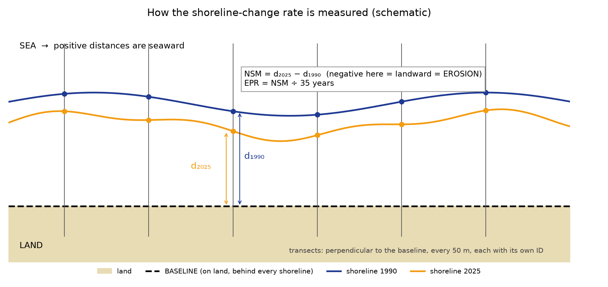

# 02 — Method (plain English)

*Status: Phases 3–4 written; Phases 5–6 sections are appended as they are finished. Everything here describes what the code in `src/aparri/` actually does. Parameters are in `config/config.yaml`; nothing is hard-coded.*

**Words you will need.** *Shoreline* — the line where land meets sea at the moment a satellite image was taken. *Baseline* — a reference line drawn on land, behind every shoreline. *Transect* — a short line perpendicular to the baseline, like a measuring tape laid out to sea. *NSM* (Net Shoreline Movement) — how many metres the shoreline moved between the first and the last year. *EPR* (End Point Rate) — NSM divided by the number of years, m/yr. *LRR* (Linear Regression Rate) — the slope of a straight line fitted through the shoreline positions of *all* years, m/yr. *CRS* — coordinate system; we measure in EPSG:32651 (UTM zone 51N, metres), never in degrees or in the web-map system EPSG:3857.

**Sign convention (same as the thesis).** Movement towards the sea is **positive** (accretion), movement towards the land is **negative** (erosion).

## 1. Inputs and why they are cleaned first (Phase 3A)

Three legacy products exist (`docs/01_data_audit.md`, `docs/01b_gee_audit.md`). The vector shoreline lines (product B) are the only ones that contain five complete shorelines, but they arrive as 3–6 loose fragments per year, one stretch of 2010 is digitised twice, and one line is labelled "Hig" instead of a year. `src/aparri/clean.py` therefore:

1. reprojects to metres and splits multi-part lines;
2. **quarantines** any feature whose year is not a number (it is *not* guessed; a human sets `manual_year_overrides` in the config);
3. finds stretches digitised twice within one year (≥ 80 % of a fragment lies within 60 m of the others) and keeps the longest continuous version — each removal is logged (2010: two fragments, 18.3 km);
4. cuts out self-crossing loops shorter than 50 m (digitising slips) and only *reports* longer loops;
5. joins end points closer than 5 m;
6. tags every part of every line as **open coast** (the wave-exposed, sea-facing coast) or **estuarine bank** (the Cagayan River banks) with one transparent rule: a tight outline (concave hull) is wrapped around all shorelines of all years; parts within 350 m of its sea-facing edge are open coast. The result is exported to `data/interim/scope_review.gpkg`, where the students can correct any part in QGIS (column `scope_override`) and point `scope.review_mask_file` at the edited file.

Everything that was changed is in `outputs/tables/clean_log.csv`; things a human must decide are in `outputs/tables/clean_review_list.csv`; the picture is `outputs/maps/clean_review.png`.

**Why open coast only?** Thesis: *"one continuous shoreline … wave action, storm surges and monsoon winds"*. River banks move for other reasons (floods, bar migration), and their lines are broken at the river mouth in every year. The decision is recorded as D-06 (`scope.include_estuarine_banks: false`) and can be flipped in the config.

## 2. A second, independent shoreline set (Phase 3B)

The Earth Engine edge-pixel rasters are thinned to a one-pixel centre line (`skeletonize`), speckle (tiny holes, spurs, components not touching the coast) is removed with every removal logged, and the lines are tagged with the same open-coast rule. Where the two sets overlap along the open coast they agree to a median of 7–14 m (95 % within 20–40 m) for every year (`outputs/maps/raster_vs_vector_offsets.png`) — about one Landsat pixel. They do **not** cover the same ground: the Earth Engine box misses the first ~2 km (Bulala Sur) and the last ~3 km (Paddaya).

## 3. Baseline and transects (Phase 4)

1. **Reference line** — the 1990 open-coast shoreline of the *source set* (`baseline.source_set`, vector_clean). The same measuring grid is used for every shoreline set so they can be compared transect by transect.
2. **Smoothing** — a 200 m moving average removes digitising jitter so that the perpendiculars do not fan out.
3. **Which side is land?** — decided, not assumed: test points 300 m either side of the line are checked against the municipal land polygons (`Aparri Barangays.shp`); the side with more points on land is land. A config override per sector exists (`baseline.landward_override`).
4. **Push landward** — the smoothed line is moved landward by the largest landward excursion of any year in that sector **plus** 150 m, so that the baseline lies behind every shoreline.
5. **Transects** — one every 50 m, perpendicular to the baseline, extending 600 m seaward of the smoothed reference line and 600 m landward of the baseline. IDs look like `S2-0143` (sector 2, 143rd transect). Sectors are the unbroken stretches of coast (the river mouth separates them).
6. **Reading distances** — for every year the transect is intersected with that year's shoreline; the distance from the baseline point to the crossing is recorded (`data/processed/<set>/shoreline_points.csv`). If a transect crosses a line more than once the rule `transects.multi_hit_rule` decides (default: the crossing nearest the baseline) and the transect is flagged `multi_hit`. If there is no crossing the year is `missing`.
7. **Flags** — `crossing` (a neighbouring transect crosses it: a fan, so the rate is meaningless), `sharp_bend` (normals turn more than 15° in 50 m), `start_not_on_land`. A transect is **valid** when both end years exist and it has no `crossing`/`start_not_on_land` flag.

## 4. Metrics (Phase 4, `metrics.py`)

| Metric | Formula | Notes |
|---|---|---|
| NSM | d(2025) − d(1990) | metres, + seaward |
| SCE | max(d) − min(d) over all available years | Shoreline Change Envelope |
| EPR | NSM ÷ T | T = 35 years from the calendar years **unless real acquisition dates are given for all five years** in `config.acquisition_dates`; the column `T_source` says which |
| LRR | least-squares slope of d against year, all years present | needs ≥ 3 dates, else empty with a note; with standard error, R², 95 % confidence interval |
| WLR | same, weighted by 1/E² | only when per-year uncertainties are configured |

**Uncertainty is never invented.** Error components (georeferencing, digitising, pixel, tidal) are `null` until the students provide them. The pixel component (30 m, the Earth Engine `SCALE`) is applied automatically *only* to the Landsat-derived sets (`raster_clean`, `landsat_v2`). The combined year error is the root-sum-of-squares of the components that are given; EPR uncertainty is √(E₁₉₉₀² + E₂₀₂₅²) ÷ T. Status: `COMPLETE` (all four given), `PARTIAL` (some given → only a **lower bound**, e.g. 30 √2 ÷ 35 = 1.21 m/yr), `NOT_PROVIDED` (none; `vector_clean`, because the origin of those lines is unknown).

## 5. How we know the engine is right

`tests/test_transects.py` builds synthetic coasts with known answers: a straight shoreline retreating exactly 2 m/yr gives EPR = LRR = −2.000; advancing 1.5 m/yr gives +1.500; concentric circular arcs (curved coast) reproduce the radius change within 0.01 m/yr; a missing year still gives the LRR from the other years and an empty, explained LRR when fewer than three dates remain; a hooked shoreline is flagged `multi_hit` and the `nearest`/`farthest` rules give different, correct answers; and swapping land to the other side of the line gives identical signed results.

## 6. Risk classes, segments and tables (Phase 5)

* **Class** from the erosion rate e = max(0, −EPR): Low e < 2, Medium 2 ≤ e ≤ 5 (both ends inclusive), High e > 5 m/yr (`config.risk`). Accreting transects (EPR > 0) are Low (`risk.accretion_class`) and tagged `trend = accreting`.
* **Unclassified** — a transect with a `crossing` flag (a neighbouring transect crosses it: a fan at the river-mouth hook) or whose start is not on land has no meaningful rate; it keeps its raw number (`risk_class_raw`) but is **not** classified and is drawn grey.
* **Segments** — the 2025 open-coast shoreline is cut halfway between neighbouring transects; each piece inherits its transect's class, EPR, LRR, barangay and confidence (`outputs/layers/Aparri_Erosion_Risk_v2.gpkg`, style `Aparri_Erosion_Risk_v2.qml`).
* **Confidence** — high / medium / low. *Low*: invalid or fan/bend transect. *Medium*: multiple crossings, a missing year, or the class would change inside the error band. *High*: none of these. The error band is the configured uncertainty if given; while none is configured it is a **what-if of ±30 m per date (one Landsat pixel)** = ±1.21 m/yr (`risk.confidence_scenario_unc_m`). `unc_basis` in the data says which was used.
* **Barangay** — each transect goes to the nearest study-barangay polygon within 500 m of its mean shoreline position (a plain intersection would lose the coast, which is the polygon edge).
* **Table 4.2** — computed only from rebuilt transects. Kilometres of shoreline per class is the primary measure; hectares are kilometres × a 100 m coastal strip (decision D-08) and are labelled as such. No number comes from the legacy CSV.

## 7. Limitations and uncertainty (plain English)

1. **Resolution.** The imagery is 30 m Landsat. Over 35 years one pixel is 0.86 m/yr; one pixel at both ends is ±1.21 m/yr. The Low/Medium boundary (2 m/yr) is only 1.7 such steps away, so a large share of the coast sits within the error of a class boundary (`class_may_flip`). Medium at Bulala Sur/Norte is the most robust finding; Low versus Medium elsewhere is a matter of convention and error.
2. **Dates and tide.** The exact acquisition dates are unknown (the legacy composites are whole-year medians) and a shoreline taken at high tide differs from one at low tide by tens of metres on a gently sloping beach. Tide state was not recorded; no tide model was available. EPR therefore uses 35 calendar years.
3. **Shoreline indicator.** The shoreline is the water/land edge of an optical image (a "waterline"). It is not the vegetation line or the erosion scarp, which are the features that engineers and residents observe. Field verification (`docs/field_validation_form.md`) is the planned check.
4. **Provenance.** The vector lines' origin is unknown (Q-G1). They were cleaned reproducibly and compared with an independent raster-derived set (Phase 6: median disagreement 10–17 m, 92 % class agreement), but that comparison cannot detect errors the two sets share.
5. **River mouth excluded.** The Cagayan River banks and the Linao spit hook are not classified; their rates are dominated by floods and bar migration and the transects there cross each other. Including them (sensitivity run `with_estuarine`) produces the only "High" values.
6. **Rate, not risk.** Classes describe the erosion rate only. Exposure (people, buildings, roads) and vulnerability were not assessed — the thesis itself states this (Ch. III p. 41 and Ch. IV p. 60).
7. **End-point rate uses two dates.** Intermediate shorelines (2000/2010/2020) are shown and used in the LRR, but the thesis defines the class from the 1990–2025 EPR; the two estimators disagree on the class for about one transect in nine.
