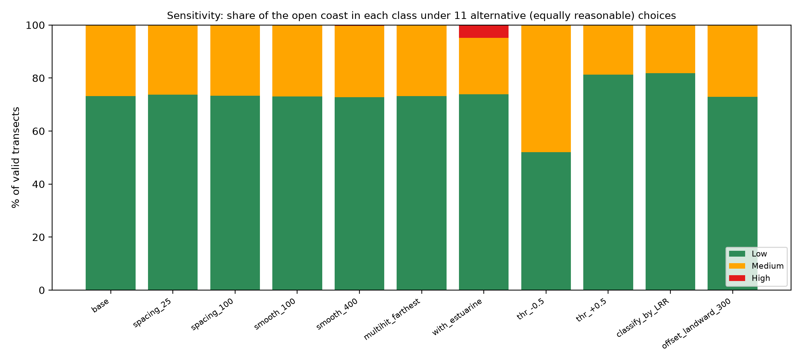
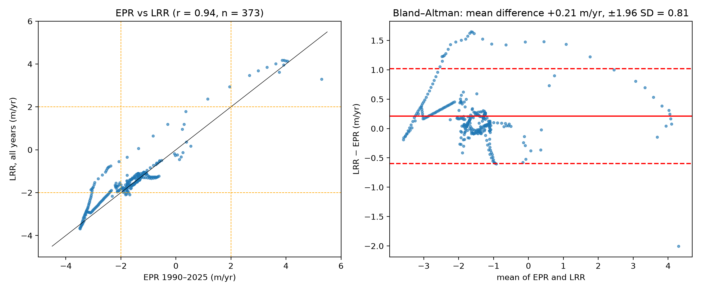
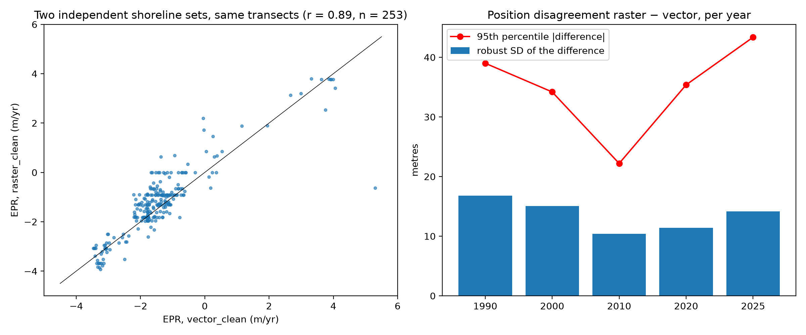

# 05 — Sensitivity, validation and robustness (Phase 6)

*Generated by `make sensitivity`. All runs use the same engine and the primary shoreline set (`vector_clean`); one choice is changed at a time. "% of the coast" = share of valid 50 m transects (equal spacing, so it is proportional to kilometres).*

## Executive summary — which conclusions are robust?

1. **Technical choices do not matter.** Transect spacing (25/100 m), baseline smoothing (100/400 m), baseline offset (150→300 m) and the multi-hit rule change the share of any class by at most **0.5 percentage points**.
2. **The thresholds matter a lot** because most of the coast sits near the 2 m/yr boundary: moving both cut-offs by −0.5 m/yr makes 48 % of the coast Medium; by +0.5 m/yr only 19 % (base 27 %). The class map is therefore a statement about a **convention**, not a natural boundary.
3. **EPR vs LRR:** r = 0.94; they disagree on the class for 11 % of transects (37 of the 42 disagreements are "EPR higher class than LRR"). Classifying with LRR gives 18 % Medium instead of 27 %.
4. **Robust (same class in ≥ 90 % of the runs):** Maura, Bulala Norte, San Antonio, Paddaya, Punta, Bulala Sur. **Not robust:** Dodan, Linao.
5. **No High class on the open coast in any run except two**: with estuarine banks included (4.8 % High, all at the river mouth) and with the 400 m smoothing (0.3 % = 1 transect(s)). The thesis statement "High risk (> 5 m/yr) along Bulala Sur/Bulala Norte" is **not** reproduced under any tested choice; the highest open-coast erosion rate among valid transects is -3.5 m/yr (Medium).
6. **Independent source:** the raster-derived set (Earth Engine masks, cleaned) gives the same class for 92 % of 253 transects, EPR r = 0.89, difference RMSE 0.69 m/yr.

## 1. One-at-a-time sensitivity runs

| scenario | description | transects | n_valid | pct_Low | pct_Medium | pct_High | mean_EPR | median_EPR |
|---|---|---|---|---|---|---|---|---|
| base | base run | 415 | 373 | 73.19 | 26.81 | 0.00 | -1.57 | -1.46 |
| spacing_25 | transect spacing 25 m | 830 | 749 | 73.70 | 26.30 | 0.00 | -1.55 | -1.45 |
| spacing_100 | transect spacing 100 m | 207 | 187 | 73.26 | 26.74 | 0.00 | -1.58 | -1.46 |
| smooth_100 | baseline smoothing 100 m | 415 | 368 | 73.10 | 26.90 | 0.00 | -1.58 | -1.46 |
| smooth_400 | baseline smoothing 400 m | 414 | 390 | 72.82 | 26.92 | 0.26 | -1.58 | -1.45 |
| multihit_farthest | multi-hit rule: farthest crossing | 415 | 373 | 73.19 | 26.81 | 0.00 | -1.55 | -1.46 |
| with_estuarine | include estuarine banks | 688 | 475 | 73.89 | 21.26 | 4.84 | -2.07 | -1.38 |
| thr_-0.5 | thresholds shifted -0.5 m/yr | 415 | 373 | 52.01 | 47.99 | 0.00 | -1.57 | -1.46 |
| thr_+0.5 | thresholds shifted +0.5 m/yr | 415 | 373 | 81.23 | 18.77 | 0.00 | -1.57 | -1.46 |
| classify_by_LRR | classify with LRR instead of EPR | 415 | 373 | 81.77 | 18.23 | 0.00 | -1.36 | -1.33 |
| offset_landward_300 | baseline offset 300 m instead of 150 m | 415 | 369 | 72.90 | 27.10 | 0.00 | -1.57 | -1.46 |

Per-barangay stability (dominant class = class with most transects; worst = highest class holding ≥ 10 % of transects):

| barangay | base_dominant | base_worst | runs | pct_runs_same_dominant | pct_runs_same_worst | robust | classes_seen |
|---|---|---|---|---|---|---|---|
| Dodan | Low | Medium | 10 | 90 | 80 | False | Low,Medium |
| Maura | Low | Low | 10 | 100 | 90 | True | Low |
| Bulala Norte | Medium | Medium | 10 | 100 | 100 | True | Medium |
| San Antonio | Low | Low | 10 | 100 | 100 | True | Low |
| Linao | Medium | Medium | 10 | 70 | 90 | False | Low,Medium |
| Paddaya | Low | Low | 10 | 100 | 90 | True | Low |
| Punta | Low | Low | 10 | 90 | 90 | True | Low,no data |
| Bulala Sur | Medium | Medium | 10 | 100 | 100 | True | Medium |

Full per-run per-barangay table: `outputs/tables/sensitivity_barangay_class.csv`.

## 2. EPR and LRR

EPR uses only the first and last date; LRR uses all five. With five dates the LRR is the more robust estimator (it is not hostage to two noisy end points) but the thesis defines the risk from EPR, so EPR remains the primary class and LRR is shown beside it.

Mean LRR − EPR = +0.21 m/yr (SD 0.41). Class confusion (rows EPR, columns LRR):

| EPR class | Low | Medium |
|---|---|---|
| Low | 268 | 5 |
| Medium | 37 | 63 |

## 3. Agreement between independent shoreline sets

Both sets are measured on the **same** transects (the baseline is built once from the vector set, decision D-09). The raster-derived set comes from the Earth Engine edge-pixel masks; the vector set is the hand-digitised/unknown-origin lines. They are independent processing chains, though they may share the same underlying imagery, so common errors are *not* captured.

| year | n | bias_median_m | robust_sd_m | rmse_m | p95_abs_m | share_within_60m | n_core | sd_core_m | proposal_sigma_per_date_m |
|---|---|---|---|---|---|---|---|---|---|
| 1,990.0 | 296.0 | -5.6 | 16.8 | 38.2 | 39.0 | 1.0 | 291.0 | 15.4 | 11.9 |
| 2,000.0 | 293.0 | -5.9 | 15.1 | 47.6 | 34.2 | 1.0 | 283.0 | 14.5 | 10.6 |
| 2,010.0 | 284.0 | 1.7 | 10.4 | 37.9 | 22.2 | 1.0 | 277.0 | 9.9 | 7.3 |
| 2,020.0 | 283.0 | 4.6 | 11.4 | 39.6 | 35.4 | 1.0 | 270.0 | 10.9 | 8.1 |
| 2,025.0 | 283.0 | 0.6 | 14.2 | 35.1 | 43.4 | 1.0 | 268.0 | 12.6 | 10.0 |

* Median bias per year is within ±6 m; the robust SD of the position difference is 10–17 m; 96–98 % of transects agree within 2 pixels (60 m).
* Rates: EPR r = 0.89, mean difference +0.21 m/yr, RMSE 0.69 m/yr, 95 % of differences below 1.21 m/yr; LRR difference RMSE 0.62 m/yr.
* Class agreement 91.7 % (rows vector, columns raster):

| vector_clean class | Low | Medium |
|---|---|---|
| Low | 191 | 3 |
| Medium | 18 | 41 |

### Proposed uncertainty values (PROPOSALS — for the students to confirm, NOT used in any result)

The last column of the table above, `proposal_sigma_per_date_m`, is the robust SD of the between-set difference divided by √2 (if the two sets had equal, independent errors, each would carry that share). Plain reading: **a defensible per-date shoreline position error for this coast is of the order of 7–12 m from the evidence of the two sets, but the Landsat pixel (30 m) is the stated resolution of the source imagery and the physical floor for any Landsat-based shoreline.** Until the students supply georeferencing, digitising and tidal components, `config.uncertainty_m` stays `null`; if they accept the evidence, a reasonable choice would be pixel = 30 (stated), digitizing ≈ 10, georeferencing and tidal to be estimated from the imagery metadata and a tide table. With the full 30 m the EPR uncertainty is ±1.21 m/yr, which is larger than the Low/Medium boundary distance for most of the coast (see `class_may_flip` in Table 4.2 extended).

A conclusion that **does** depend on the source: 21 of 253 transects change class between the sets; their vector-set EPR lies between -2.21 and -1.57 m/yr (i.e. near the 2 m/yr boundary), by barangay: Dodan (15), Maura (3), Paddaya (3).

## 4. Field validation template (nothing here claims validation was done)

`outputs/field_validation/field_validation_points.csv` (and `.gpkg`) lists **20 verification points** chosen deterministically: at least one per barangay × class stratum present, spread evenly along each stratum, each at the 2025 shoreline position of a valid transect. Blank columns are for the students to fill in the field: date, recorder, GPS device and accuracy, distance to the vegetation line and to the waterline, tide state/time, presence and condition of protection structures, evidence of erosion (scarp, undercut trees, exposed roots), photo file names, notes. A printable checklist is in `docs/field_validation_form.md`.

| point_id | barangay | predicted_class | transect_id | EPR_m_yr | LRR_m_yr | confidence | lon | lat |
|---|---|---|---|---|---|---|---|---|
| V01 | Bulala Norte | Medium | S1-0039 | -3.4600 | -3.5900 | high | 121.5787 | 18.3830 |
| V02 | Bulala Norte | Medium | S1-0047 | -3.3800 | -3.2600 | high | 121.5819 | 18.3812 |
| V03 | Bulala Sur | Medium | S1-0010 | -2.5900 | -2.2300 | medium | 121.5666 | 18.3893 |
| V04 | Bulala Sur | Medium | S1-0020 | -2.8900 | -2.6500 | medium | 121.5708 | 18.3871 |
| V05 | Dodan | Low | S3-0173 | -1.7900 | -1.8100 | medium | 121.7062 | 18.3371 |
| V06 | Dodan | Low | S3-0181 | -1.7800 | -1.1800 | medium | 121.7097 | 18.3358 |
| V07 | Dodan | Medium | S3-0157 | -2.1600 | -1.7000 | medium | 121.6990 | 18.3395 |
| V08 | Linao | Low | S1-0094 | 3.8600 | 4.1700 | high | 121.6027 | 18.3734 |
| V09 | Linao | Medium | S1-0065 | -3.0800 | -2.1200 | medium | 121.5894 | 18.3773 |
| V10 | Linao | Medium | S1-0074 | -2.8200 | -1.3500 | medium | 121.5933 | 18.3755 |
| V11 | Maura | Low | S3-0061 | -0.9000 | -1.2700 | medium | 121.6566 | 18.3549 |
| V12 | Maura | Low | S3-0089 | -1.8900 | -1.9500 | medium | 121.6689 | 18.3502 |
| V13 | Maura | Low | S3-0118 | -1.1100 | -1.1400 | medium | 121.6818 | 18.3459 |
| V14 | Maura | Medium | S3-0148 | -2.0400 | -1.5400 | medium | 121.6951 | 18.3409 |
| V15 | Paddaya | Low | S3-0221 | -1.3700 | -1.1100 | medium | 121.7274 | 18.3295 |
| V16 | Paddaya | Low | S3-0251 | -1.3800 | -1.1100 | medium | 121.7407 | 18.3246 |
| V17 | Punta | Low | S3-0011 | 0.2500 | -0.1300 | high | 121.6340 | 18.3612 |
| V18 | Punta | Low | S3-0012 | 0.5300 | 0.1700 | high | 121.6345 | 18.3612 |
| V19 | San Antonio | Low | S3-0024 | -0.5900 | -0.5100 | high | 121.6400 | 18.3602 |
| V20 | San Antonio | Low | S3-0028 | -1.0500 | -0.9500 | medium | 121.6418 | 18.3596 |

*Why these checks:* a satellite shoreline can be right in position and still be a poor "erosion indicator" (a waterline moves with the tide; a vegetation line or erosion scarp does not). One visit with a GPS and a tape across 20 points tells the panel more than any further processing.
